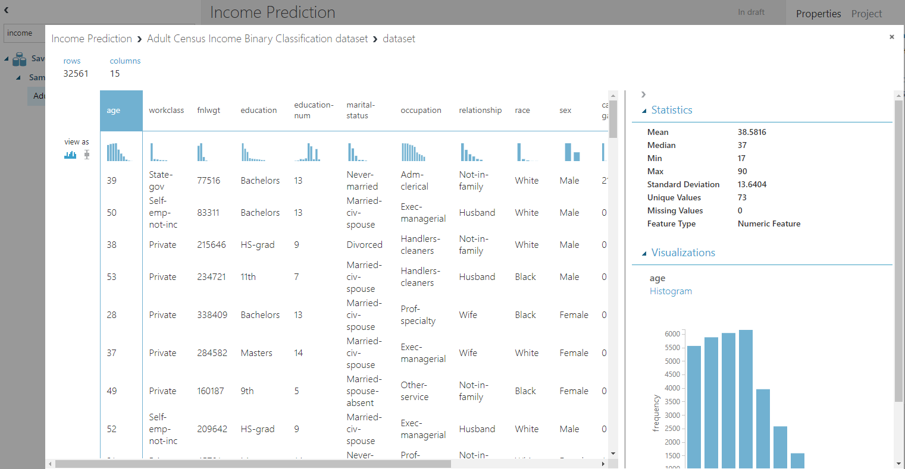
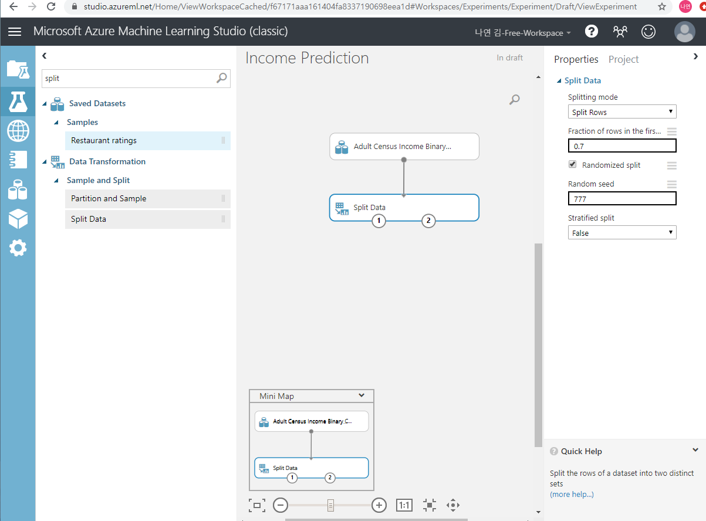
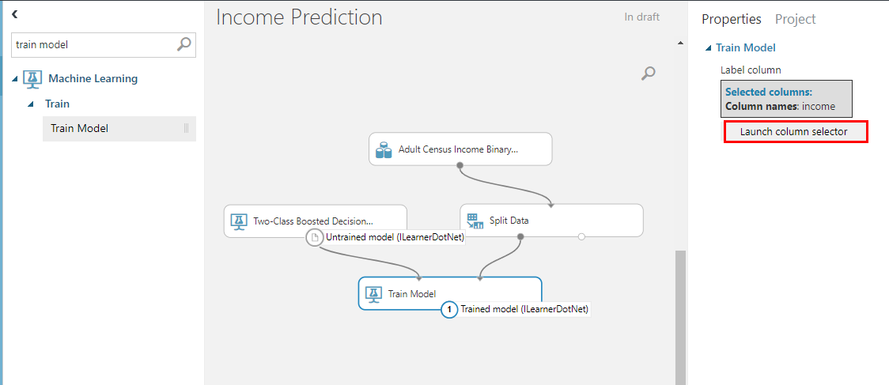
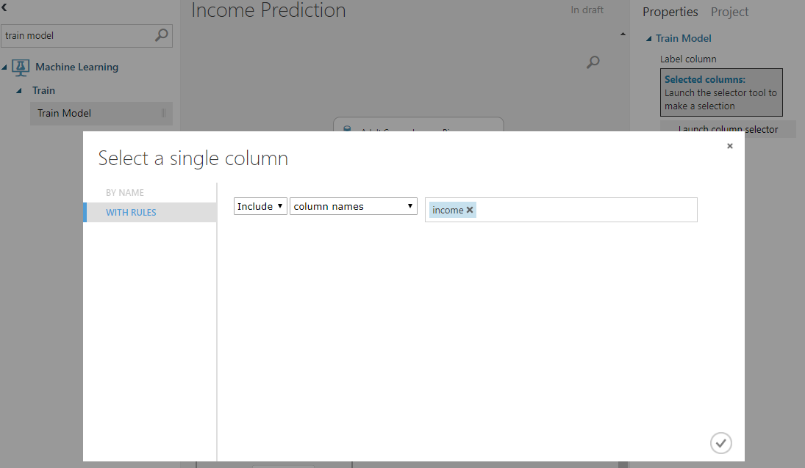
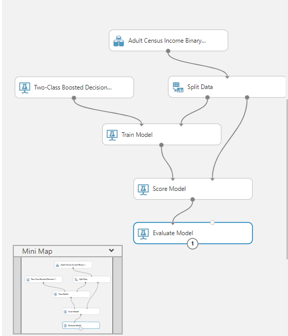
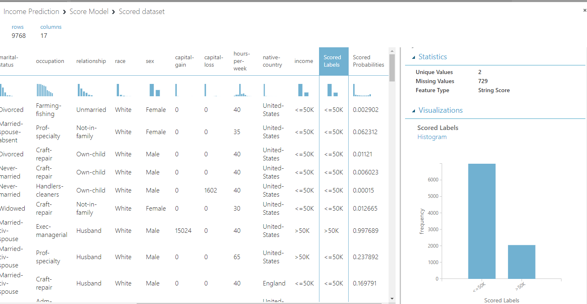

### 200312 Azure 머신러닝

#### Azure

> 클라우드 컴퓨팅 플랫폼

##### azure machine learning studio 사용 이유

* 코딩 대신 클릭으로 머신러닝 모델 쉽게 만들 수 있음

> 1. 컴퓨팅 자원 부족하기 때문에
> 2. GPU기반 설정 작업 번거로움 있기 때문에
> 3. 학습도구 설치 어려움 줄일 수 있음
> 4. 버전 관리 용이
> 5. 주피터 노트북 설치 및 관리

##### 모델 개발 과정

1. 실험 데이터 삽입 : azure cloud에 실험 데이터 넣어 줘야 함
2. 실험 데이터 전처리 작업
3. 데이터 특징 추출 : 모델 목적에 부합되는 특징 추출
4. 머신러닝 알고리즘 선택 > 학습 > 모델 > 평가 > 오류 체크 
5. 모델 저장
6. 웹 서비스 배포 가능

##### [연습사이트](studio.azureml.net)

###### 다양한 기능

* 로그인 > 왼쪽 밑에 NEW 

  > DATASET(data 업로드 가능: R, 파이썬 스크립트 파일도 업로드해서 모듈화하여 사용 가능)

  > MODULE: R 스크립트 업로드해서도 사용 가능

  > PROFECT: 프로젝트만들 때 사용
  
  > EXPERIMENT: 주로 사용할 작업
  >
  > > 15개의 category
  > >
  > > * Saved Datasets : 데이터셋 저장 장소로 Samples data 기본 제공 사용 or 직접 업로드하여 모델 만들 수 있음
  > > * trained model로 모델 트레이닝 가능
  > > * Data Format Conversions: 데이터 변환해서 저장 가능
  > > * Data input and output: data가져오기와 내보내기 가능
  > > * Data Transformation: data 합치거나 결측값 처리 작업, 제거 작업 가능, 부족한 data 늘리는 (SMOTE) 작업 가능
  > > * Feature selection: feature 추출 작업할 때 사용
  > > * **Machine Learning**: 가장 자주 사용할 작업으로 머신러닝 모델이 미리 만들어져 있음
  > > * OpenCV: 영상처리기능 들어가있는 라이브러리로 이미지 작업 처리 할 수 있음
  > > * Statistical Functions: 통계 관련 함수 제공함, 기술 통계 - 통계검정 같은
  > > * Text Analytics: 텍스트 분석 작업 
  > > * Deprecated: 곧 사라질 작업들 모아놓은 것
  
  > NETEBOOK: 파이썬, R을 직접 코딩하여 파일 만들어 작업 가능
  >
  > > 주피터 노트북 사용 가능 - 클라우드에서 만들어 실행되는 주피터 노트북으로 로컬이 아닌 클라우드에서 작업되는 것

#### 연습

##### Income Prediction

* Adult Census Income dataset을 drag&drop 해준다

> dataset 오른쪽 마우스 > dataset > visualize로 한눈에 시각화된 데이터 확인 가능

* data를 train/test set으로 나눠줘야 함
  * split data 찾아서 drag&drop > 데이터셋과 마우스로 연결해주면 데이터 split 가능!
    * properites에서 데이터 나누는 비율과 random 여부, seed값 지정해줄 수 있음
    * Stratified split는 클래스가 나누어진 dataset이라면 클래스별로 7:3으로 데이터 나눠주는 것으로 옵션으로 지정 가능

* Two-Class Boosted Decision Tree 알고리즘 선택해서 drag&drop

* train model 검색해서 drag&drop

  * train model이 model 만드는 작업해줌
  * data와 알고리즘만 있으면 트레이닝해서 모델 만들어줌!

  

> 모델 만들려면 dataset에서 x,y 값 지정해줘야 함. 
>
> > 알고리즘 선택 > properties > launch column selector에서 선택 가능 

* score model 선택해서 drag&drop
* evaluate model 선택해더 drag&drop > 모델 평가

* run 눌러주면 실행 > 끝!

* score model > scored dataset > visualize에서 실제값(income)과 예측값(scored label) 확인 가능

> azure가 머신러닝 완성한 값도 파이썬 코드로 변환해서 볼 수 있음

